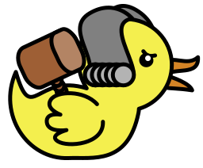
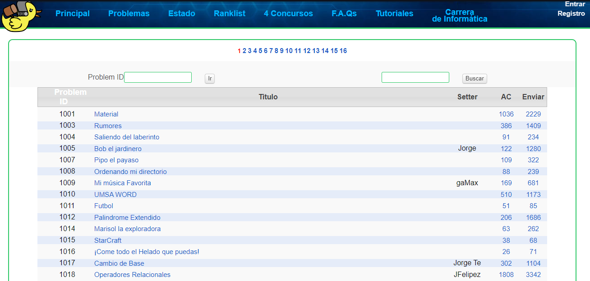

# Ejercicios juez pato
## Exercises Judge duck

    
    
    
    
       

URL de la plataforma : https://jv.umsa.bo

  
Tecnologías:
    
    
    
  

# Ejercicios de la plataforma JVUMSA - JUEZ PATITO

## Contenido del repositorio

El repositorio contiene varias carpetas, cada una de las cuales representa una solución diferente para un problema específico. Dentro de cada carpeta se encuentra el código fuente de la solución, así como cualquier archivo de entrada o salida necesario para probar la solución.

## Contribuciones

¡Todas las contribuciones son bienvenidas! Si tienes una solución diferente a la presentada aquí o si deseas mejorar una solución existente, no dudes en enviar tu solucion.

## Licencia

Este proyecto se distribuye bajo la licencia Apache 2.0. Consulte el archivo `LICENSE` para obtener más información.

## Contacto

Si tienes alguna pregunta o comentario sobre este repositorio, no dudes en ponerte en contacto conmigo por correo electrónico o por medio de mi perfil en Github.

